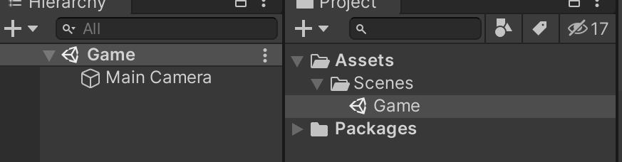
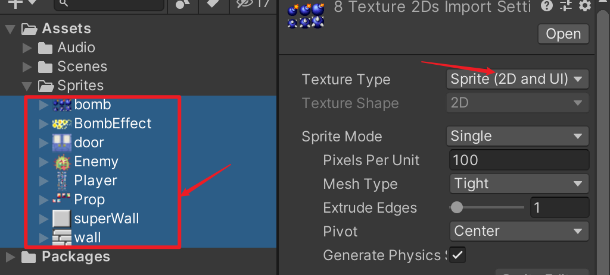
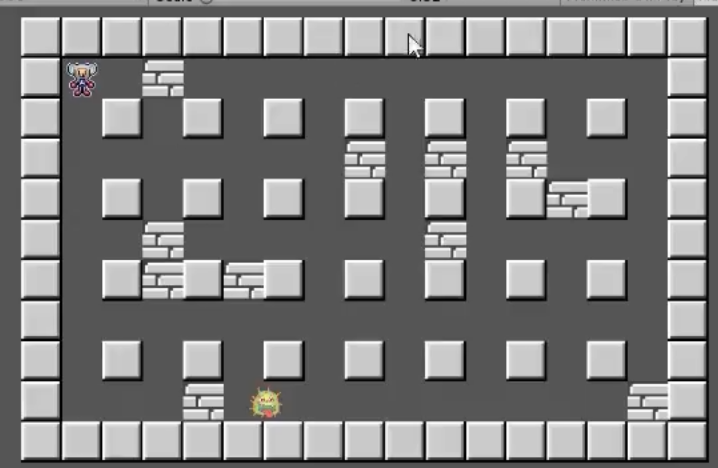
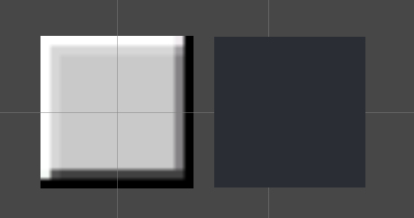
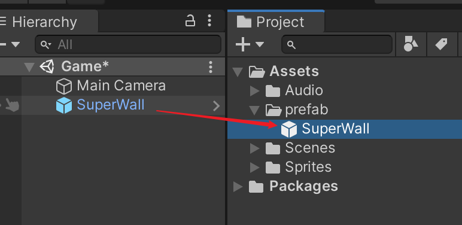
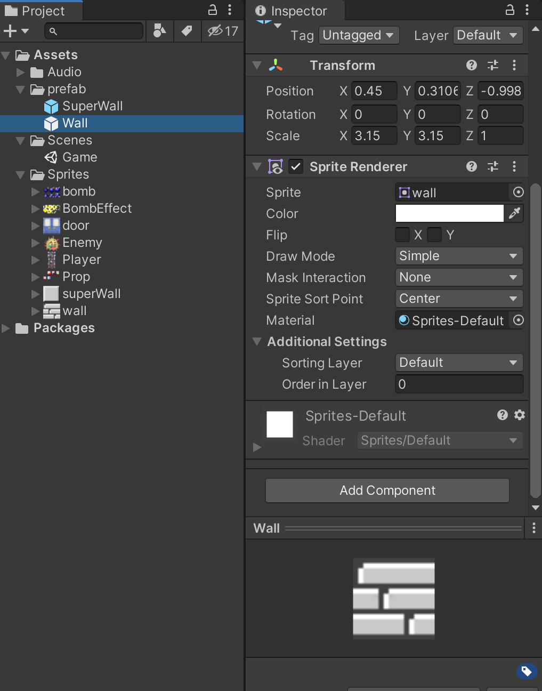
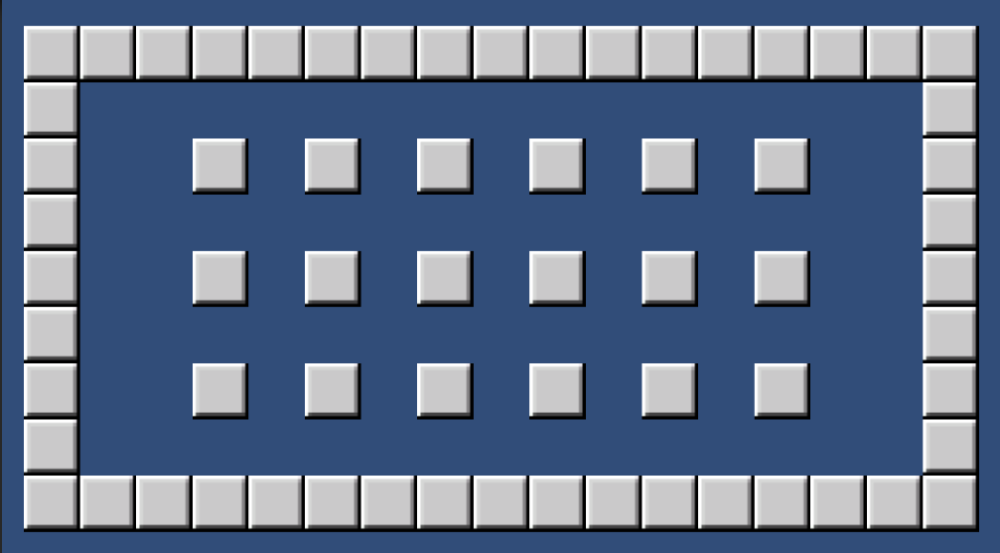

# Bombman
unity 2D练习，学习unity的完整开发流程。

## 创建项目

- 删除自带的scene

- 创建自己的scene

  

  这个是2D项目所以是没有灯光的。

## 导入资源



将type需要设置为sprite。

## 创建墙

目标：



### 准备资源

需要创建一个墙，这个墙的我们先做预制体。

- 创建sprite，设置图集

- 缩放

  我们为了sprite显示为1，我们需要通过缩放的方式。

  - 创建一个cube.

  - 我们缩放，使得图片的大小和cube的一致就可以。

    

- 拖到Asset中

  

- 让就可以删除掉了

- 同理创建第二个

点击预制体然后进行修改，就是对所有的修改

​	

### 开始生产墙

使用脚本进行控制，所以先创建一个文件夹。然后创建一个生成墙的脚本，我们将它挂在到游戏物体上，才可以进行执行。

使用脚本得到

```java
public class WallController : MonoBehaviour
{
    public GameObject superWallPre;
    /**
     * 行列
     */
    private int X;
    private int Y;

    private void Awake()
    {
        InitMap(8,4);
    }

    public void InitMap(int x,int y) {
        this.X = x;
        this.Y = y;
        CreateSuperWall();
    }

    /// <summary>
    /// 生成实体墙
    /// </summary>
    private void CreateSuperWall() {
        for (int i = -X+2; i < X-2; i += 2) {
            for (int j = -Y+2; j < Y; j += 2) {
                GameObject wall = Instantiate(superWallPre,transform);
                wall.transform.position = new Vector3(i+1,j);
            }
        }

        ///up
        ///
        for (int i = -X; i < X - 1; i ++) {
            GameObject wall = Instantiate(superWallPre, transform);
            wall.transform.position = new Vector3(i + 1, Y);
        }

        ///down
        ///
        for (int i = -X; i < X - 1; i++)
        {
            GameObject wall = Instantiate(superWallPre, transform);
            wall.transform.position = new Vector3(i + 1, -Y);
        }

        ///left
        ///
        for (int i = -Y; i <= Y; i++)
        {
            GameObject wall = Instantiate(superWallPre, transform);
            wall.transform.position = new Vector3(-X, i);
        }

        for (int i = -Y; i <= Y; i++)
        {
            GameObject wall = Instantiate(superWallPre, transform);
            wall.transform.position = new Vector3(X, i);
        }
    }
}
```

